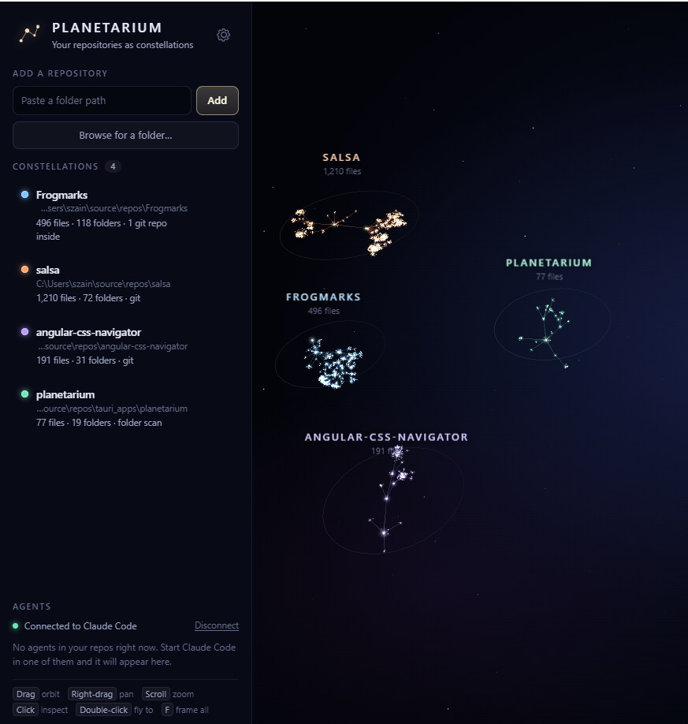

# Planetarium

See your repositories as 3D constellations, and watch Claude Code agents move through them live.
Planetarium also catches agents that are about to overwrite each other's work.

<!-- Screenshot: save one as docs/screenshot.png, then remove these comment markers.

-->

Each repo you add becomes a constellation: the bright core star is the repo root, folders branch
outward, and files cluster around their folder. Connect Claude Code and every agent shows up as a
marker in its repo's color. Each agent flies to the file it's reading or editing, and when it goes
quiet it slowly orbits the ring around its repo.

Built with Tauri v2 (Rust) and WebGPU. It is one process: closing the window keeps Planetarium
running in the system tray, so it keeps tracking agents in the background.

## Download

Get the latest installer (`Planetarium_x.y.z_x64-setup.exe`) from the
[Releases](../../releases) page and run it. It adds Planetarium to the Start menu and installs
anything missing that it needs. A portable `planetarium.exe` is attached to each release too.

**"Windows protected your PC":** the app isn't code-signed yet, so Windows warns about it the
first time. Click **More info**, then **Run anyway**. That's expected for small open-source
apps; you can always build it yourself from this source instead (see below).

**You'll need:**
- Windows 10 or 11
- [Claude Code](https://docs.claude.com/en/docs/claude-code/overview), for the agent tracking
- A graphics card that supports WebGPU (nearly any from the last several years)

Then open Planetarium, add a repo, and click **Connect Claude Code** in the sidebar.

## Using it

- **Add repos** by pasting a path, clicking **Browse for a folder…**, or dropping a folder on the window.
- **Connect Claude Code** with the button in the sidebar's Agents section. This makes four
  changes, each backed up first (`<file>.planetarium-backup`), and **Disconnect** removes exactly
  them and nothing else:
  - Planetarium's hooks in `~/.claude/settings.json`. Running sessions pick these up at once.
  - Planetarium's tool server in `~/.claude.json` (where Claude Code keeps MCP servers). Only
    sessions started afterwards get the tools.
  - `mcp__planetarium` in `permissions.allow`, so those tools don't prompt you every time. They
    only talk to Planetarium; they can't read or change files.
  - A status line (only if you don't already have one): it passes your plan's usage-limit
    numbers to Planetarium and shows them under Claude Code's prompt. If you have your own
    status line, Planetarium leaves it alone and the usage meter stays empty.
- **Usage meter and "Wind down all agents".** The Agents section shows how much of your session
  (5-hour) and weekly limits is used and when they reset (Pro/Max plans). **Wind down all
  agents** asks every working agent to find a stopping point, with your own editable message
  (the percentage and reset time are filled in). Each agent gets it on its next step; agents
  between turns aren't sent it, so it never shows up later when you tell one to continue. The
  button turns amber from 90%. Afterwards the sidebar marks which agents stopped, so you know
  which ones to tell to continue once your usage resets.
- **Agents:**
  - **Working:** flies to the file it's touching, leaving a trail. Edits make it flare.
  - **Idle:** no file activity for about 20 seconds, or finished its turn. It circles the repo's ring.
  - **Waiting:** a main agent whose subagents are still working. It circles the ring, breathing.
  - **Finished:** fades out.
  - Subagents are smaller and tethered to the agent that started them.
- **Held files and collisions.** Every file an agent edits is *held* by it until it finishes
  its turn, because it may come back to it. Agents can let go earlier with Planetarium's
  `release` tool when they're done with a file. Held files glow softly in the holder's color. When
  another agent is about to edit a held file, that's a collision: the file flares amber and
  the two agents are linked. What the agents are told depends on the collision mode (gear icon
  next to the title, set globally or per repo):
  - **Off:** agents aren't told anything (you still see the collision).
  - **Warn** (default): the incoming agent gets a note before editing ("Claude · 3f9a, working on
    '…', changed this file earlier in its task. Don't undo their changes"). When an agent
    *reads* a held file, it's told right then that its copy may go stale and to read again just
    before editing, since that's the moment it matters.
  - **Ask me:** the edit pauses and a card shows both agents, their tasks and what's held. You
    can let it proceed, ask it to wait, or have it check with you first, with an optional message
    to each agent. With no answer in time (5 minutes by default), the agent is warned and continues.
  - **Work it out** (experimental, "Let them work it out"): the edit pauses and the two agents
    talk through Planetarium. The paused agent explains what it wants to change
    (`message_agent`); the holder answers go ahead, wait, or done (`reply_to_agent`; "done"
    releases the file). The exchange shows in the sidebar, where you can step in. Limits: 3
    messages per collision, then it comes to you; no reply in 90 seconds and the agent goes ahead
    carefully; an agent whose session doesn't have the tools is warned instead of stuck.
  - In every mode except Off, the holder is told on its next step when someone else edited its
    file. An agent's own subagents don't count as collisions with it, but sibling subagents do.
- Hover an agent or star for a summary and click for details. Clicking an agent in the sidebar
  flies to it.
- **Git worktrees and branches:** an agent in a worktree of one of your repos appears on the
  matching file of that repo, with its branch. Agents in different worktrees never collide. If
  the branch changes in a folder agents are working in, they're flagged and told.
- **Quit** from the tray icon's menu (right-click). Closing the window only hides it; while it's
  hidden or minimized nothing is drawn, so it costs next to nothing in the background.

| Control | Action |
|---|---|
| Drag / Right-drag / Scroll | Orbit / pan / zoom |
| Click / Double-click a star | Inspect / fly to it |
| `F` / `Esc` | Frame everything / close the details panel |

### How agent tracking works

The hooks send small event notices (session id, which tool, which file path) to
`http://127.0.0.1:47615/planetarium/hook`. Only this computer can reach that address, and
nothing leaves your machine. Planetarium answers instantly, so agents are never slowed down. If
Planetarium isn't running, Claude Code treats the unreachable hook as a non-blocking error and
carries on.

Events from folders that aren't one of your repos are ignored. Planetarium keeps only the file path and tool
name from each event. The rest, including the text of edits, is discarded as soon as it arrives.
Planetarium never approves an agent's actions for you: your normal Claude Code permission prompts still apply. The only thing Connect pre-allows is Planetarium's own three tools, which just send messages to Planetarium. The tool server lives on the same local port, and any request from a web page (anything carrying a browser `Origin` header) is refused.

## Build and run

Needs Rust (MSVC toolchain), Visual Studio's "Desktop development with C++" tools, and the Tauri
CLI (`cargo install tauri-cli --version "^2" --locked`).

- **`Dev Planetarium.cmd`**: development mode (`cargo tauri dev`).
- **`Build Planetarium.cmd`**: release build. Produces `src-tauri\target\release\planetarium.exe`
  and an installer in `src-tauri\target\release\bundle\nsis\`.

The TypeScript compiles into `web/out/`, and the compiled files are kept in the repo, so the
builds above don't need Node. After changing anything in `app/src` or `webgpu_core`:

```
npm install          # once
npm run build:web    # or: npm run watch:web
npm test             # layout tests
```

Rust tests (agent tracking, holds, collision messages, Claude Code settings edits):
`cargo test` in `src-tauri`.

## Where things are

```
src-tauri/src/
  main.rs             window, tray, single instance, commands the page calls
  server.rs           local endpoint (port 47615): hooks, the /mcp tool server, housekeeping
  agents.rs           agent state, holds, collision records, repo matching
  coord.rs            what agents are told on a collision (Off / Warn / Ask me / Work it out)
  talk.rs             "Let them work it out": agents settle a collision between themselves
  mcp.rs              Planetarium's tools for agents (release, message_agent, reply_to_agent)
  usage.rs            plan usage limits (from Claude Code's status line)
  git.rs              worktrees and branches
  settings.rs         collision settings (coordination.json)
  claude_settings.rs  Connect / Disconnect Claude Code (edits ~/.claude/settings.json safely)
  scanner.rs          git ls-files / folder walk
  store.rs            saved repo list (%APPDATA%\dev.planetarium.desktop\repos.json)
  watch.rs            file watching → debounced rescans
app/src/              the page (TypeScript): layout, scene, transitions, agents, UI
webgpu_core/          small WebGPU engine: camera + orbit (from Salsa), stars, lines, picking
web/                  what the window loads: index.html, styles, bridge.js, compiled out/
tests/                node --test tests
```

`camera-3d.ts` and `orbit-controller.ts` in `webgpu_core/` started as copies from Salsa, so a bug
fixed in one may need fixing in the other too.

## License

MIT, see [LICENSE](LICENSE). `types/webgpu.d.ts` is from the WebGPU type definitions and keeps
its own license (`types/webgpu-LICENSE`).
